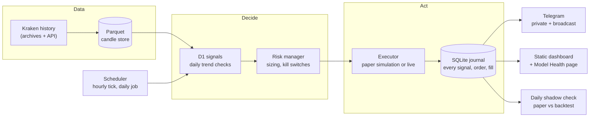
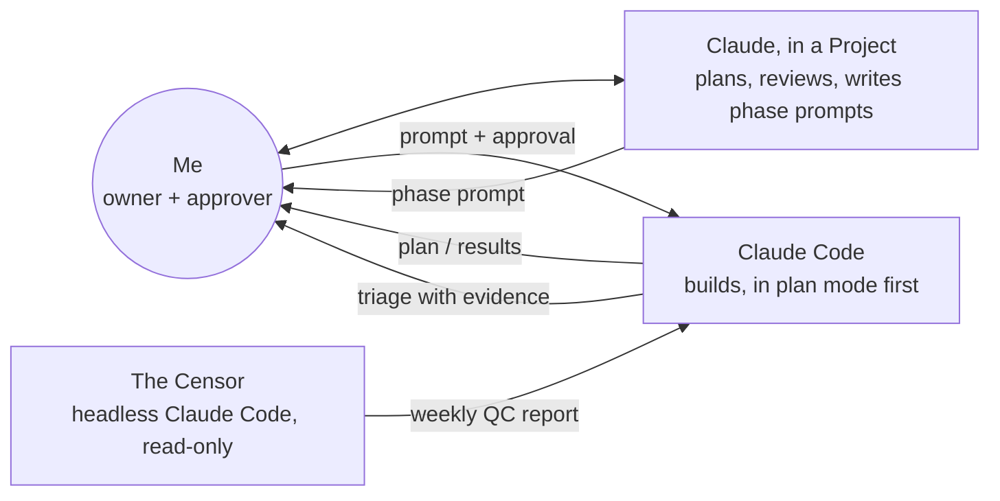

# Project Argentum

A rules-based crypto trading bot, **Argentarius**, built almost entirely with Claude Code. It's run like a small research lab:
- specifications come first;
- tests are pre-registered;
- every decision is logged;
- an AI reviewer checks the AI builder.

**Status (October 2026):** paper trading (forward test) · Kraken spot · BTC and ETH · next up: the multi-strategy platform (Phase 3b).

> This repository is a write-up of a personal project. The bot's code lives in a private repository; this one explains how it works and how it was built. Nothing here is financial advice, and no real money is trading yet.

---

## What it is

- A Python bot that trades spot **BTC and ETH on Kraken** using a daily trend-following strategy called **D1**.
- It runs unattended:
  - an hourly check;
  - a daily decision job;
  - Telegram briefings;
  - a local read-only dashboard;
  - a nightly journal backup.
- It was built through **Claude Code**, with me as product owner, reviewer and approver of every plan.

## The honest headline

D1 was **pre-registered**: its rules, parameters and pass/fail gates were written down before any test ran. It **did not pass all of its gates**.

Instead of tuning it until it did, I'm running it **unchanged** as a paper forward test against frozen expectation bands, and letting new data decide. A strategy that fails its own pre-set bar and gets tweaked until it passes is how most backtests end up lying.

## How it works

The same strategy and risk code runs in all three modes: **backtest**, **paper** and **live**. Only the data feed and the executor change between them.

More detail: [docs/ARCHITECTURE.md](docs/ARCHITECTURE.md)

## How I build with Claude Code

- **Three AI roles, kept separate.** One Claude helps me plan and review, Claude Code builds, and a separate read-only reviewer audits the code on a schedule. The reviewer lives in its own repository and never shares memory with the builder.
- **Plan mode first, always.** Every phase starts with a read-only proposal that I approve before any code changes.
- **A spec and a decision log.** A single specification plus more than 70 numbered decisions, so any session (human or AI) can pick up where the last one stopped.
- **Golden-file regression.** Refactors must leave the strategy's outputs byte-identical. Any difference stops the work.
- **Paper-safe deploys:**
  - the full test suite passes;
  - deploys stay outside the scheduled-run windows;
  - the journal is backed up first;
  - the next run is confirmed clean.
- **Evidence-based triage.** The builder must confirm or push back on each review finding with file and line references. "Agreed" alone isn't accepted.
- **Security by default:**
  - exchange keys can't withdraw;
  - secrets are scanned at commit and push time;
  - account data only ever goes to my private chat.

More detail: [docs/WORKFLOW.md](docs/WORKFLOW.md) · sample prompts: [docs/prompts/](docs/prompts/)

## Roadmap

| Stage | What | Status |
|---|---|---|
| Foundation and research | Data store, backtest engine, validation suite, first strategies | Done |
| D1 | Pre-registered daily trend strategy; did not pass all gates, so it runs as a forward test | Done |
| Paper operations | Daily job, Telegram, dashboard, security hardening, tax-reserve estimates | Done |
| Folder move and backup | Repository moved into a project folder that will also hold its reviewer; private GitHub backup with a pre-push secret check | Done |
| Phase 3b | Multi-strategy platform and multi-coin plumbing, with zero behavior change | Next |
| Phase 3c | The automated reviewer (the Censor) and the triage loop | Planned |
| Phase 3d | Simulated-clock harness: months of scheduled runs in minutes | Planned |
| Clean paper | 14 days on the final code before any real money | Planned |
| Phase 4 | Linux server and small live trading | Planned |
| Phase 5 | A crypto ETF track on a stock broker, held to a written statistics standard | Future |

More detail: [docs/ROADMAP.md](docs/ROADMAP.md)

## Tech stack

- **Language and tooling:** Python 3.12 · uv (locked dependencies) · pytest · ruff
- **Data:** CCXT (Kraken) · pandas · Parquet (pyarrow) · DuckDB for ad-hoc SQL
- **Journal:** SQLite via SQLAlchemy 2 · Alembic migrations
- **Config:** pydantic models over YAML; secrets only in environment files
- **Operations:** Windows Task Scheduler for paper · Linux and systemd timers for live · Telegram · static HTML dashboard
- **AI:** Claude Code (desktop and headless `claude -p`) · Claude Projects for planning

## In this repository

| File | What it covers |
|---|---|
| [docs/ARCHITECTURE.md](docs/ARCHITECTURE.md) | Components, modes, data, risk, operations |
| [docs/WORKFLOW.md](docs/WORKFLOW.md) | How the AI-assisted build process works, step by step |
| [docs/RESEARCH_METHODS.md](docs/RESEARCH_METHODS.md) | Pre-registration, validation, and the statistics standard |
| [docs/ROADMAP.md](docs/ROADMAP.md) | What's done, what's next, what's further out |
| [docs/LESSONS.md](docs/LESSONS.md) | What I learned, including what went wrong |
| [docs/prompts/](docs/prompts/) | Excerpts from real phase prompts |
| [DEVLOG.md](DEVLOG.md) | Short dated progress notes |

## About

Built by [@dlivie1](https://github.com/dlivie1) as a personal project.

This repository has no open-source license. You're welcome to read it and link to it, but please don't republish it as your own.
