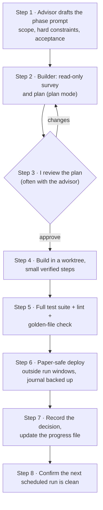
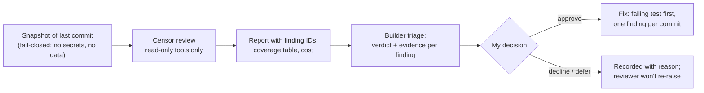

# How I build with Claude Code

This project is as much about the process as the bot. Here's the workflow, what each piece is for, and what I'd tell someone starting their own.

## Three roles, kept separate

| Role | Tool | Job | What it can't do |
|---|---|---|---|
| **Advisor** | Claude, in a Claude Project | Planning, reading sources, reviewing Claude Code's plans, writing the phase prompts, keeping the roadmap | Touch the code |
| **Builder** | Claude Code, in the bot's repository | Proposes a plan, then builds, tests and deploys once I approve | Change anything before I approve the plan |
| **Reviewer ("the Censor")** | Headless Claude Code (`claude -p`) in its own repository | Reviews a snapshot of the code on a schedule and writes a report | Edit, run commands, use the network, or see the builder's memory |

And me: I own every decision. Nothing ships without my approval, and anything that would change the strategy's behavior needs a written decision first.

Keeping the reviewer in its own repository, with its own memory, is deliberate. A reviewer that shares the builder's notes tends to share its blind spots.

## The life of a phase

### 1. Phase prompts

Each phase gets one prompt, written before work starts, with the same parts every time:
- **Scope,** including what the phase is NOT, which matters as much.
- **Hard constraints:** for example, "no change to the strategy's rules; golden files must stay identical; no new features".
- **Work rules:** plan mode first, ask before deviating, tests alongside code.
- **Acceptance criteria and an end-of-phase report.**

The prompts are kept in a Claude Project, so planning conversations have the whole history. Excerpts are in [prompts/](prompts/).

### 2–3. Plan mode and approval

- **The survey is read-only.** Claude Code always starts by looking at the actual code before proposing anything.
- **I approve, change or push back.** Often I bring the plan back to the advisor for a second look. Several plans got better at this step:
  - a missing re-registration of a scheduled task;
  - a test alert that would have written fake briefings into the live journal;
  - a memory folder that would have leaked into the wrong project after a folder move.

### 4. Worktrees

Work happens in a separate git worktree, so the paper bot keeps running from the main folder untouched. Parallel work streams get their own worktrees and branches.

### 5. Golden files

- **What they are:** before a refactor starts, the builder saves the strategy's complete outputs: backtest results, gate values, fills, equity curves, and the paper decisions replayed.
- **The check:** after every step, the outputs must be byte-identical. Any difference is a failure, not a judgment call.
- **Why it matters:** this is what makes large reorganizations safe on a live system.

### 6. Paper-safe deploys

- the full suite and the golden-file check pass;
- merges happen outside the minutes around each hourly run and outside the daily-job window;
- the journal is backed up with SQLite's backup API first;
- the next scheduled run is confirmed clean.

### 7. Decisions and progress files

- **The decision log:** every meaningful choice becomes a numbered entry in DECISIONS.md (more than 70 so far), with its reasoning.
- **Progress files:** each big phase keeps one with completed steps and commit hashes, so a fresh session can resume exactly where the last one stopped.

## Memory lives in files, not sessions

- **Why not one long session:** a long-running AI session isn't a reliable memory. Context fills up and gets summarized, and details fade.
- **What the project relies on instead:**
  - **CLAUDE.md:** project rules every session loads;
  - **the spec and DECISIONS.md:** the source of truth;
  - **progress files:** where each phase stands;
  - **Claude Code's own memory notes,** which are per repository and shared across its sessions.
- **The habit this enables:** a fresh session per phase, a clear session name, and archiving it once its work is merged and recorded.

## The QC loop

- **Verdicts:** confirmed, partial, rejected, already fixed, duplicate, out of scope, or needs investigation. Each one needs file-and-line evidence.
- **Behavior impact:** every fix is labeled either neutral (golden files unchanged) or changing (needs its own decision and a deliberate golden-file update).
- **Disputes:** when the builder disagrees with the reviewer on anything serious, the disagreement is recorded, and I decide.
- **The feedback loop:** the reviewer reads the triage record on every run, so rejected findings aren't raised again and repeated false positives can be tuned out of its prompt.
- **Costs are visible:** each run logs its tokens, a list-price equivalent and the share of my plan's usage limits it used. Models and effort levels are configurable per pass.

## Guardrails that run every day

- **Secrets:**
  - never pasted into chat, never passed on a command line or in a scheduled-task definition;
  - scanned for at every commit and every push;
  - exchange keys have no withdrawal permission.
- **Account data** only goes to my private chat. A test scans every message template.
- **Dependencies** are locked and only updated through one deliberate command that runs the full suite.
- **The strategy's rules, gates and expectation bands are frozen.** The reviewer is told to file anything touching them as "out of scope", never as a fix.

## Feeding the AI good sources

For research-heavy work, such as the statistics behind a new strategy, I feed in sources one at a time. For each one, the advisor:
1. summarizes it and rates its credibility (peer-reviewed? author standing? errors?);
2. lists what would change in our standards;
3. waits for my approval before anything is written down.

When a source was a blog, I asked for the official documentation to cross-check it. That caught several errors, like advice that would have silently broken PowerShell scripts.

## If you're starting your own

- **Write the spec first** and make every phase prompt point back to it.
- **Make the AI propose before it builds,** and actually read the plans.
- **Ask for evidence, not agreement.** "Confirm or push back, with file and line" works much better than "does this look right?"
- **Put memory in files.** Start sessions fresh.
- **Keep a reviewer that isn't the builder.**
- **Change one big thing at a time,** so when something breaks, you know why.
